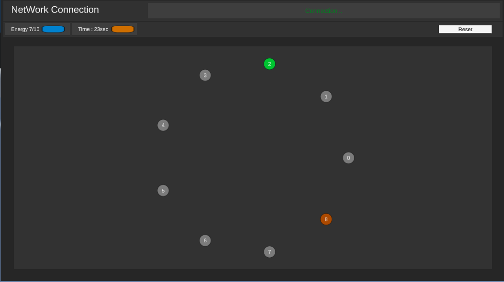
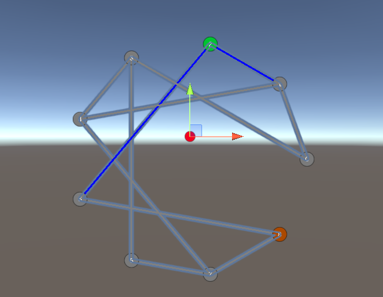

### 📆 오늘의 TIL (Today I Learned)

---

1. **노드 네트워크**: 화면에 여러 개의 노드가 표시되며, 각 노드는 서로 다른 기능을 가집니다.

2. **시간 제한**: 플레이어는 제한된 시간 내에 미션을 완수해야 합니다. 난이도가 높아질수록 시간이 더 짧아집니다.

3. 노드 유형

   :

   - **Entry(시작)**: 항상 네트워크 침투를 시작하는 노드입니다.
   - **Standard(일반)**: 기본 네트워크 노드입니다.
   - **Firewall(방화벽)**: 이 노드에 연결하면 시간이 감소합니다(-5초).
   - **Encrypted(암호화)**: 이 노드에 연결하면 목표 달성에 필요한 총 연결 수가 증가합니다.
   - **Proxy(프록시)**: 이 노드에 연결하면 시간이 증가합니다(+5초).
   - **Target(목표)**: 최종 목표 노드입니다.

4. **경로 선택**: 플레이어는 가능한 연결 중에서 최적의 경로를 선택해야 합니다. 모든 노드가 연결될 수 있는 것은 아닙니다.

5. **성공 조건**: 목표 노드에 도달하고 최소 필요 연결 수를 충족해야 합니다.

## 구현 아이디어

1. 화면에 노드를 무작위로 배치하고, 가능한 연결을 선으로 표시할 수 있습니다.
2. 노드 간 연결을 만들 때 시각적 효과(전기가 흐르는 듯한 애니메이션)를 추가하여 몰입감을 높일 수 있습니다.
3. 배경에 디지털 코드나 바이너리 숫자가 흐르는 효과를 추가하여 해킹 분위기를 강화할 수 있습니다.
4. 난이도에따라 노드 수, 연결 가능성, 시간 제한을 조정할 수 있습니다. 

해당 이미지는 2번에서 시작해서 8번노드에 도달하면 클리어가 가능하다.

해당 노드는 이런 구조로 이루어져 있으며,

2번 노드와 1번,5번이 기본적으로 활성화 되어있고, 5번노드는 1번노드가 켜져있다면 작동되지 않는다.

7번노드는 1번 3 번 5번이 켜져야 작동됨으로 모든 노드를 켜기 위해서 5번 1번 34670순서대로 작동하면 된다.

각 연결된 노드가 활성화 되지 않는다면 노드는 비활성화 되며 이러한 구조를 유추해서 목표에 도달하면 점수를 얻게 설계할 예정이다.

이 외에도 다른 조건들을 사용하면 상당히 어려운 퍼즐이 될 것이다.
