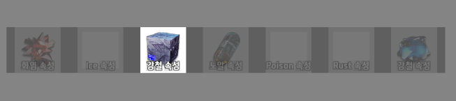

### 📆 오늘의 TIL (Today I Learned)

# Unity Input System의 이벤트 처리 트러블 슈팅

## 문제 상황
- 무기 아이템을 획득한 후  입력 키(A, S)를 이용해 무기 속성을 전환하는 기능 구현 중에 문제가 발견되었다.
- 무기 속성이 3개 이상일 때, A 또는 S 키를 누르고 있으면 중간에 의도하지 않은 속성으로 변경되었다가, 키를 떼면 원하는 속성으로 변경되는 현상 발생
- 예: 노말 속성 → S키 누름 → 화염 속성으로 일시적 변경 → S키에서 손 뗌 → 강철 속성으로 최종 변경


## 원인 분석
Unity의 새 Input System은 키 입력에 대해 세 가지 이벤트를 발생시킴:
1. `started`: 키가 처음 눌릴 때 발생
2. `performed`: 키가 눌린 상태를 유지할 때 지속적으로 발생
3. `canceled`: 키를 뗄 때 발생

문제는 다음과 같이 발생:
- 코드가 세 이벤트 모두에 대응하도록 구현되어 있었음

  ```
      public void OnNext(InputAction.CallbackContext context)
      {
      	PlayerUI.Instance.MovetoRightType();
      }// 기존 코드
      
      ------
      
      public void OnNext(InputAction.CallbackContext context)
      {
          // 키를 처음 눌렀을 때만(started) 한 번 실행
          if (context.started)
          {
              // 선택 입력 처리A, S 로 작동
              PlayerUI.Instance.MovetoLeftType();
          }
      }// 수정된 코드
      
  ```

  
- S키를 누르면 `started` 이벤트가 발생하여 첫 번째 속성 변경
- 키를 계속 누르고 있으면 `performed` 이벤트가 여러 번 발생하여 속성이 계속 변경됨
- 키를 떼면 `canceled` 이벤트가 발생하여 마지막으로 한 번 더 속성 변경

## 해결 방법
두 가지 측면에서 문제를 해결:

### 1. PlayerInputHandler.cs 수정
키가 처음 눌렸을 때만(`started`) 속성 변경이 일어나도록 수정:

```csharp
public void OnNext(InputAction.CallbackContext context)
{
    // 키를 처음 눌렀을 때만(started) 한 번 실행
    if (context.started)
    {
        // 선택 입력 처리A, S 로 작동
        PlayerUI.Instance.MovetoLeftType();
    }
}

public void OnPrev(InputAction.CallbackContext context)
{
    // 키를 처음 눌렀을 때만(started) 한 번 실행
    if (context.started)
    {
        // 선택 입력 처리A, S 로 작동
        PlayerUI.Instance.MovetoRightType();
    }
}
```

### 2. PlayerInput.cs 이벤트 구독 수정
`performed`와 `canceled` 이벤트 구독을 제거하고 `started` 이벤트만 구독하도록 변경:

```csharp
public void AddCallbacks(IPlayerActions instance)
{
    // 기존 코드 유지
    @Attack.canceled += instance.OnAttack;
    
    // Next와 Prev는 started 이벤트만 구독
    @Prev.started += instance.OnPrev;
    @Next.started += instance.OnNext;
    
    // 기존 코드 유지
    @SpecialAttack.started += instance.OnSpecialAttack;
    // ...
}
```

## 학습 내용
1. **Unity Input System의 이벤트 구조**
   - `started`, `performed`, `canceled` 이벤트의 차이점과 발생 시점 이해
   - 각 이벤트가 언제 발생하고 어떻게 처리되는지 이해

2. **입력 처리 최적화**
   - 모든 이벤트를 항상 구독할 필요 없이, 목적에 맞는 이벤트만 구독하는 것이 중요
   - 버튼 토글 같은 기능은 `started`만 필요하고, 지속적인 움직임은 `performed`가 필요

3. **디버깅 방법**
   - 이벤트 기반 시스템에서 예상치 못한 동작이 발생할 때는 이벤트 흐름을 추적하는 것이 중요
   - 콘솔 로그를 통해 각 이벤트가 발생하는 시점과 처리 로직 확인

## 결론
Unity의 Input System을 사용할 때 이벤트의 종류와 발생 시점을 명확히 이해하고, 필요한 이벤트만 구독하는 것이 중요하다. 특히 버튼 토글 기능처럼 한 번만 실행되어야 하는 동작은 `started` 이벤트만 처리하도록 설계해야 하며 조건문 없이 해당 기능을 호출하게 되면 모든 과정을 수행하게 된다는 것을 알게 되었다.
